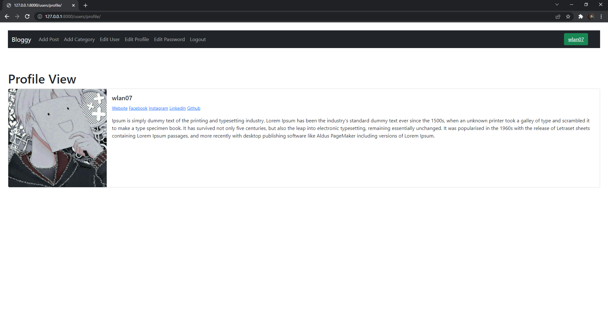
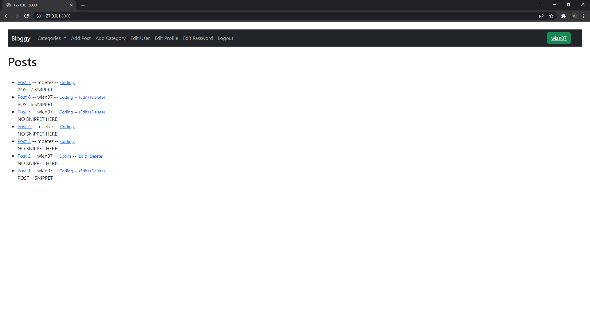
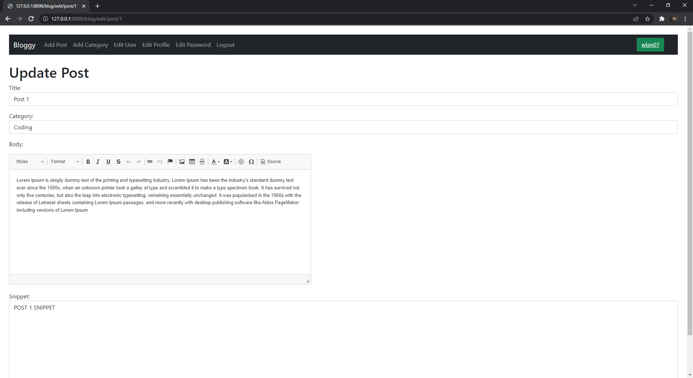
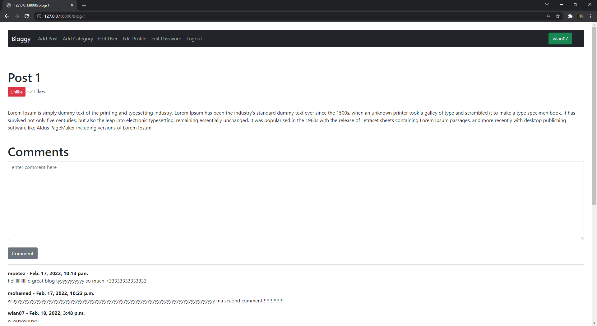
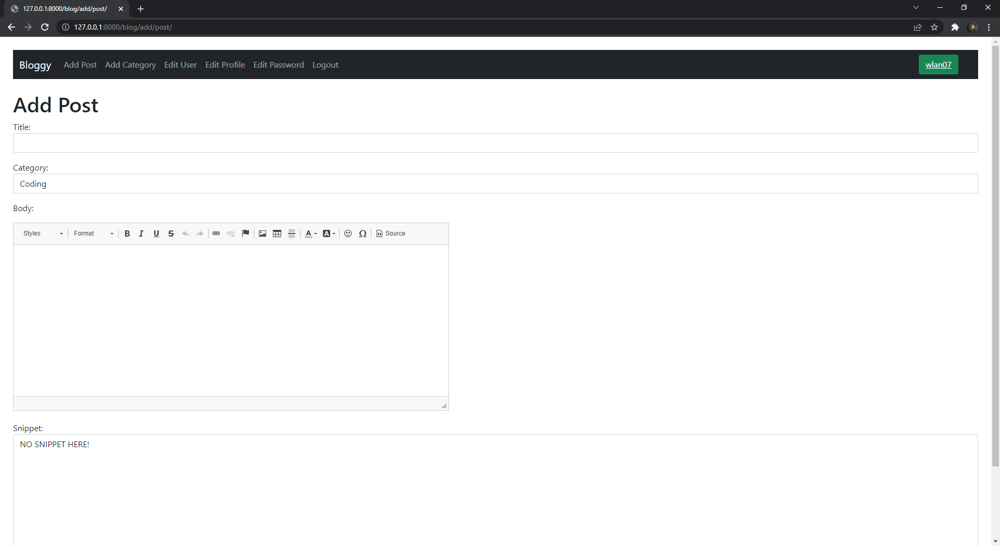
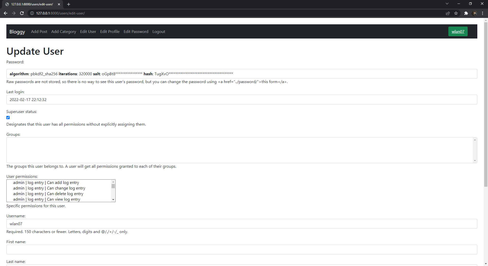
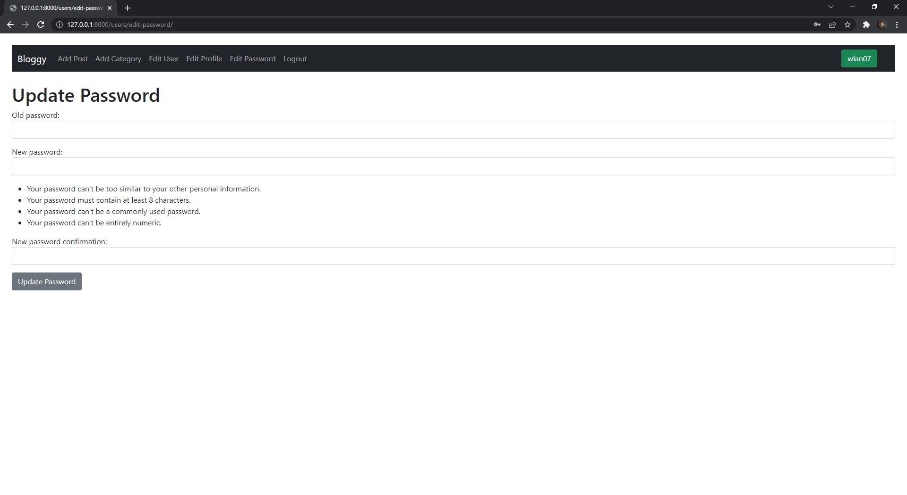
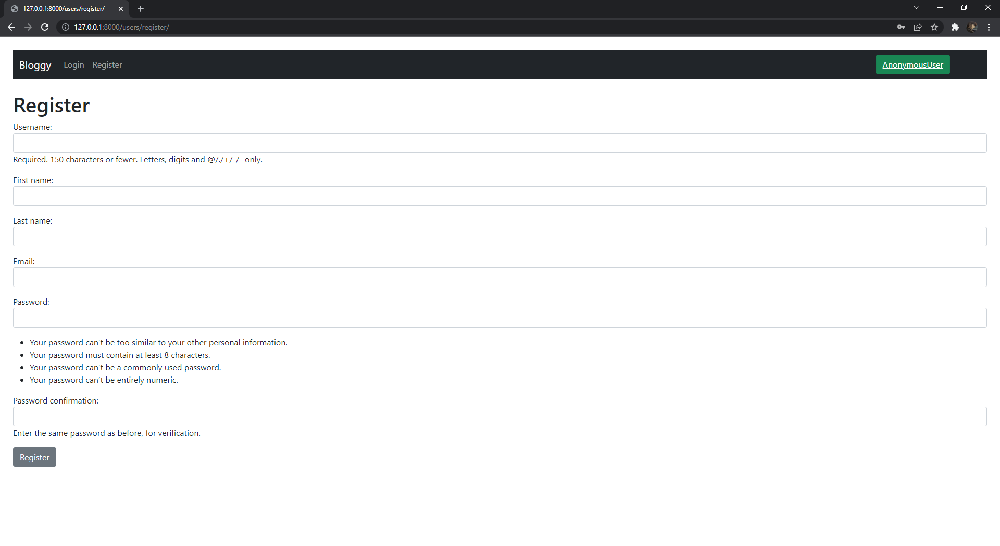

# blog_app_django
a simple blog app coded in the cool Django-framework v <b>4.0.1</b>🚀

Note : i'm new to django i've made this app along watching a how-to-make a blog app in youtube by codemy.com

[youtube link](https://youtube.com/playlist?list=PLCC34OHNcOtr025c1kHSPrnP18YPB-NFi) 

 

THANK YOU <b>John Elder</b> for this amazing django tutorials serie 

# some screen shots 

